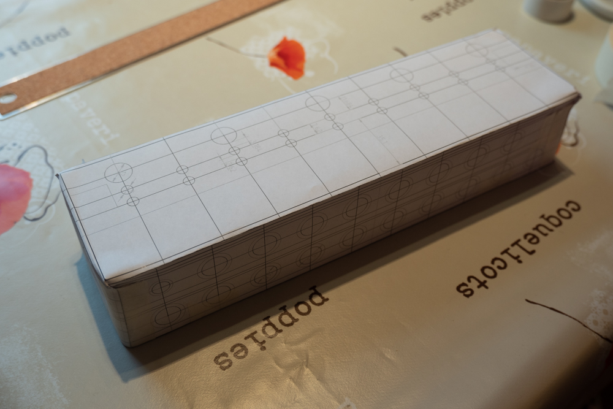
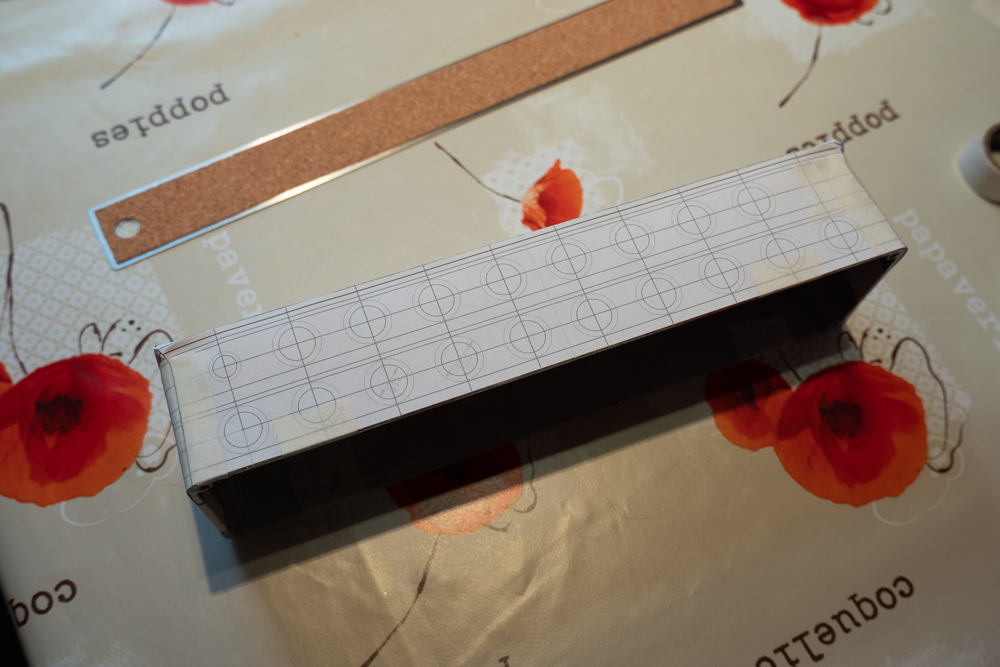
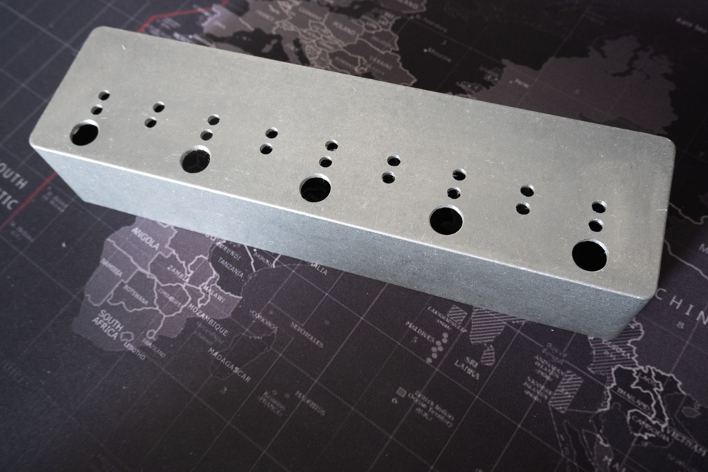
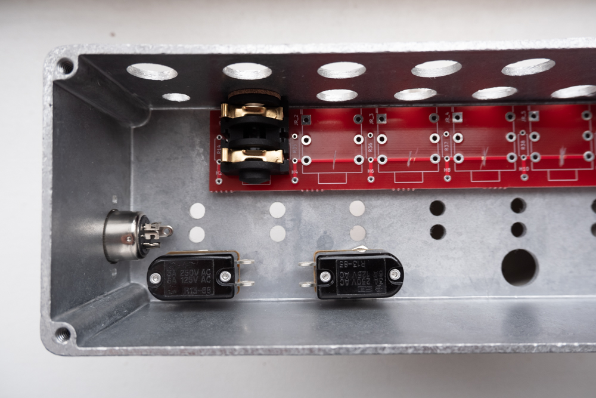
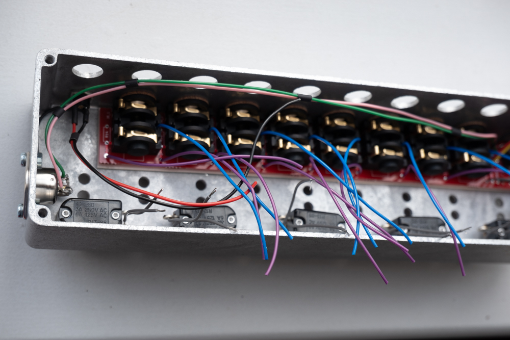
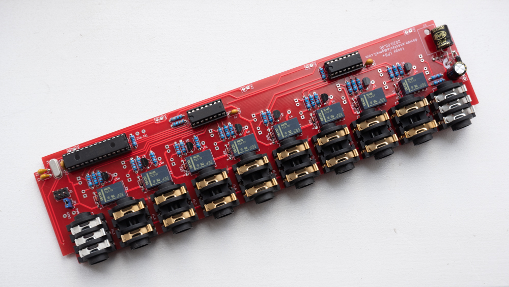
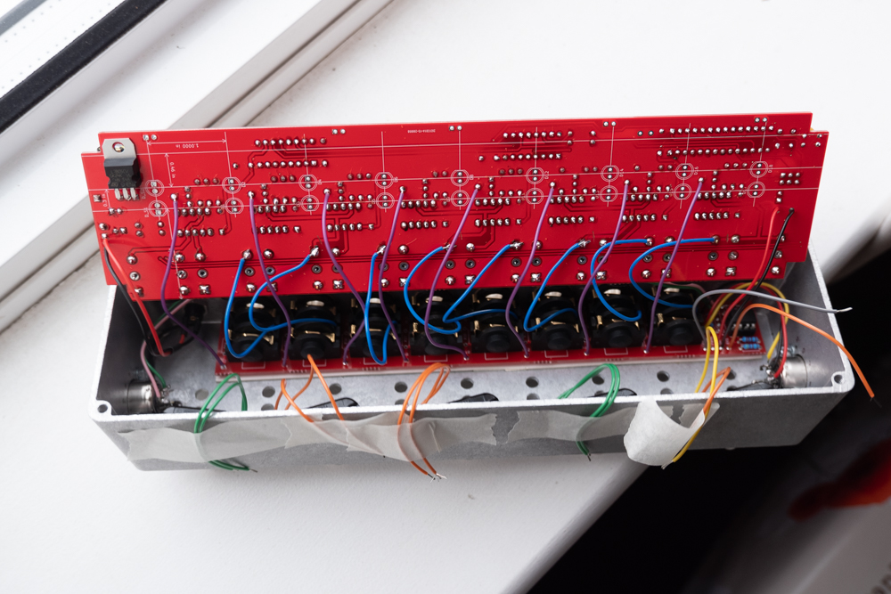
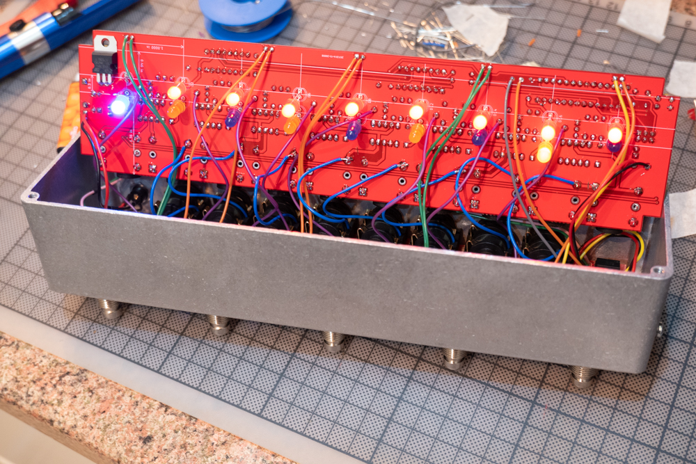
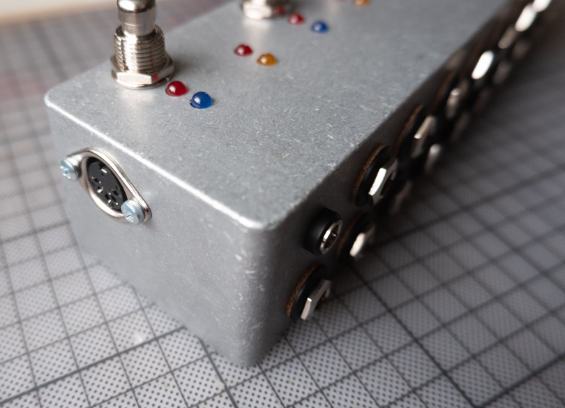
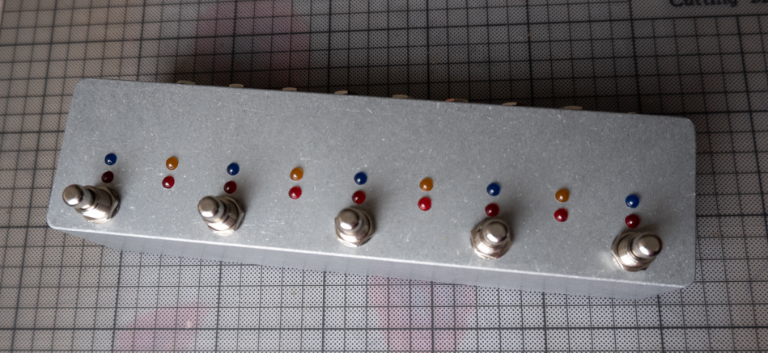

# How To Build Loopy

Loopy is a medium complexity project for the occasional DIY-er, while it should be fairly straightforward for an avid one.

##  Step 1: Drilling

In my opinion, the hardest part of the build process is drilling the enclosure, due to the large number of holes.

My method is the following:
- print the drilling template specific for your PCB
- attach the drilling template to the enclosure **being as precise as you can**    

- use a good quality center punch to set a drilling guide for each hole. It is very important especially for the holes on the front panel
- drill every hole with a pilot bit (either 2mm, 2.5mm or 3mm works, but I usually tend towards the smaller size)
- work your way up through the holes up to the right size for your components, but don't overdrill the front panel 5mm LEDs holes
- slightly overdrill the holes on the backpanel, as this will make easier to insert the PCB at the end
- clean the enclosure and get ready for soldering 

## Step 2: Soldering

**Important**: don't solder any LED on the board, as otherwise you won't be able to box up your project.

All the jacks are mounted on the two boards, so I suggest to work your way up into the enclosure in the following order:
- solder wires to all the footswitches and set them in place inside the enclosure: use a reasonable length that will allow you to solder the other end on the main board

- solder all the components on the small board, including all the wires that will connect to the main board and the MIDI sockets

- install both midi jacks and power socket into the enclosure
- install the small PCB on the bottom of the enclosure, screwing all the jacks into the right place. If you want to be extra sure none of the solder joins touches the enclosure, trim them the best you can and install a small plastic sheet at the bottom of the enclosure, secured with double-sided tape (not mandatory)
- solder the midi socket, trimming the wires to avoid them being loose in the enclosure.
- solder all the components on the main board, but **don't solder the LED**

- solder all the connection wires between the two boards, including all the footswitches and the power socket

- **you should now be able to power up your project**, and check the activation of the all the relays, as well that all the voltages are correct (especially in and out of the voltage regulator)

## Step 3: Finish it up & LED installation

If you got at this stage of the build, you are ready for the tricky part: the installation of the LED.
You need to purchase LED with long leads (so the super common one available on eBay might not do): as you might have noticed, LED will be soldered into the main board and mounted inside the 5mm hole on the front panel directly.

The following steps should get you over the finishing line:
- if your project powers up correctly and you can hear the "click" of the relay when you use the footswitch, you know you are on track
- install -- without soldering -- all the LED into the main board: silkscreen should help you get them in the correct orientation: ideally they should light up as (and when) expected by the operational mode your looper is into

- check all the LED light correctly triggering all the features (check the [manual](./manual.md) for more info)
- lock all the leads in place using small pieces of masking tapes, but don't bend the leads: this will allow you to rotate the board into its place without dropping all the LED out of the board
- tight the nut of a few jack socket so that the main board is in place
- one by one, release LED from their masking tape and make sure they finds the right hole on the front panel: might take a bit of time, so be patient
- you should be able now to power up the project and do another rundown before soldering all the LED
- if you are happy everything is working as expecteed, you can start soldering one by one all the LED and remove the excess for each lead (shouldn't be much)
- tight all the sockets
- job done

### Components Guide

#### Relays

Loopy uses miniaturised signal relays. Some of the possible options are:

- Zettler AZ850-5
- NEC EA2-5NU
- Fujitsu A-5W-K
- Panasonic/NAIS TQ2-5V

Some of these models are discontinued, but any other signal relay with the same pinout will work just fine. I have uploaded a few datasheets for consultation in the `datasheets` folder.

#### LEDs 

Any 5mm LED work in this project, but you want to be careful with the type you use and the resistors you couple with it. 

I have personally used 400mcd LEDs like the ones in [this link](https://www.switchelectronics.co.uk/blue-5mm-led-diffused-400mcd-30) with an 820R resistor, however you want to use a larger resistor value if you use high brightness LEDs, or you'll end up with a front panel too bright to be looked at without problems.

#### Audio Jack

I suggest to use the REAN/Neutrik NYS2152, but the REAN/Neutrik NYS215 works too (stereo): PCB is designed around this footprint and the schematic use stereo jacks, so an additional (unused, unconnected) hole is available on the PCB and this should give you some flexibility in the source of the part.
Drawing diagram for these jacks is in the `datasheets` folder.