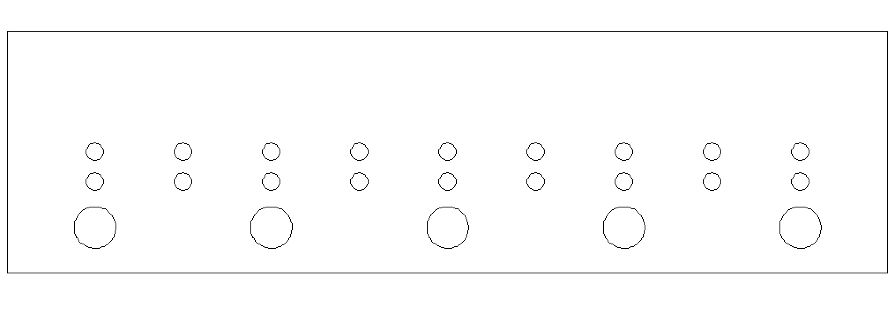
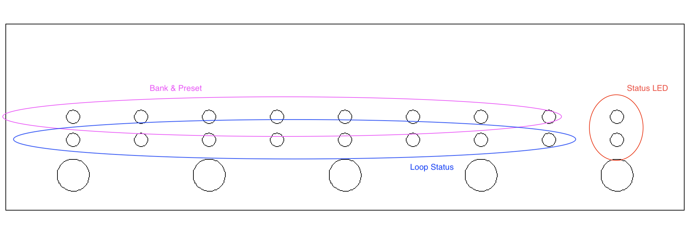
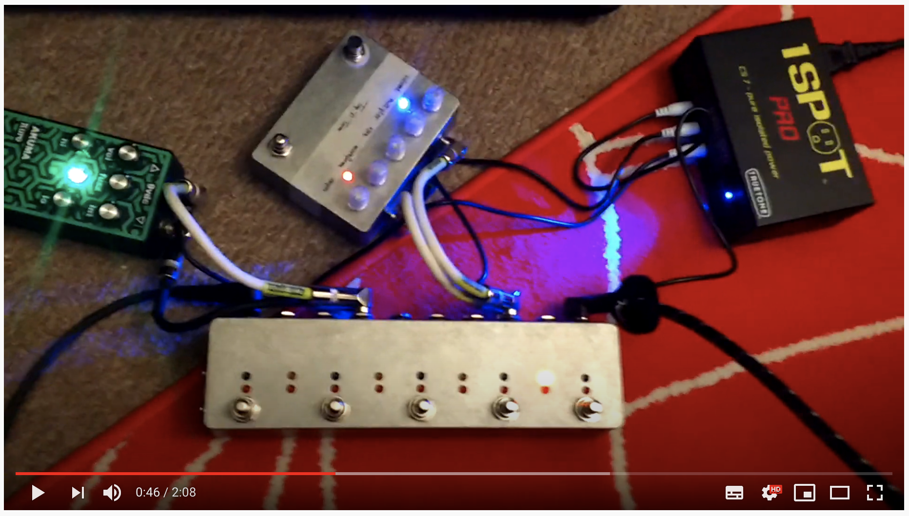
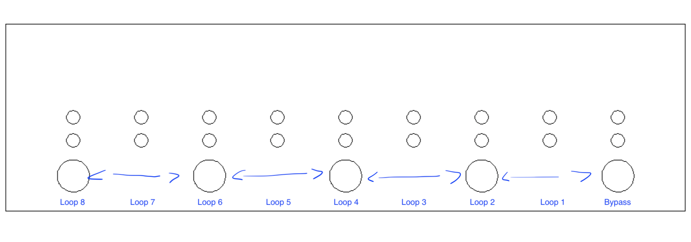
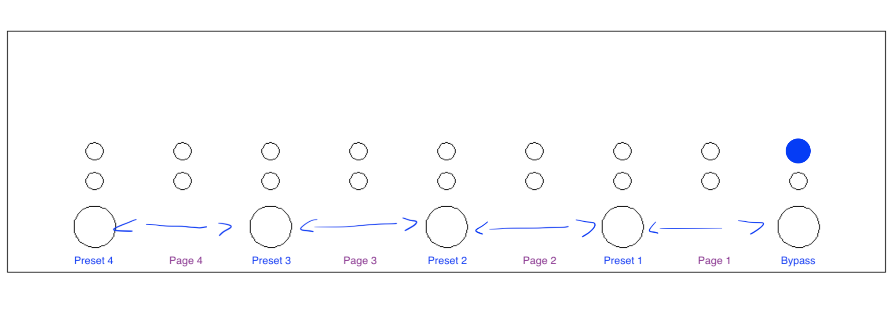
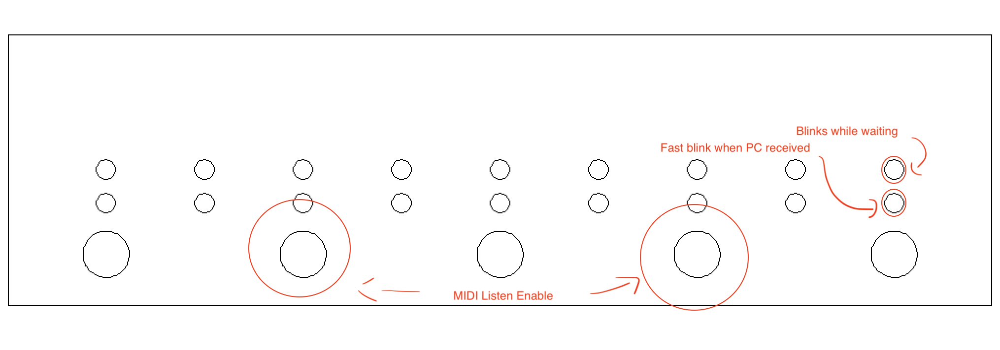
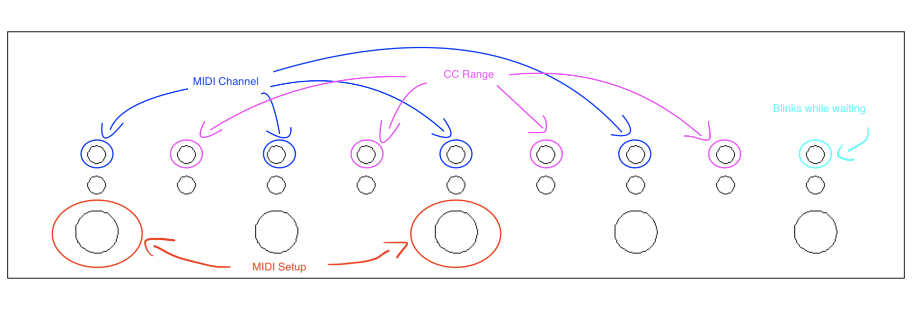

# Loopy LP8/LP422 Manual

The interface is built around 5 footswitches and 18 LED.

LED are divided into three groups:
- 2 LED on the right side to indicate the status
- 8 LED of the bottom strip to indicate whether a loop is engaged or not
- 8 LED of the top strip to indicate bank & preset

Loopy can be used in two modes:
- play
- preset

A very short video can be found below:

## Play Mode

In play mode, every loop can be directly accessed either pushing one footswitch, or two footswitch at the same time. The entire looper can be bypassed using the `Bypass` footswitch (`FS1`):

## Preset Mode

To enter (and exit) the preset mode, hold the `FS1` for 2 seconds. 

In preset mode, the first LED of the top strip will be ON to indicate the new mode.

When entering the preset mode LED on the first strip will start blinking to indicate the current page and preset. Loops will *not* immediately change their configuration when entering the preset mode to give the user the chance to select the right preset before before changing how the sound of the instrument is modified. 

The same behaviour is applied when moving across pages: no config is changed until a preset is confirmed.

Once a preset button is pressed, LED on the first strip will stop blinking and the LED on the second strip (and their associated loops) will switch on or off as programmed.

## MIDI

Since `v.2a`, MIDI support has been improved to:
- support Control Change commands
- configure MIDI channel

Version `v.1x` didn't support CC messages and was hardcoded to `Channel 1`. Instructions on how to update your firmware are available [here](./firmware.md).

### Midi Out

`MIDI Out` port is enabled when the looper is in `preset mode`. Program Change are sent to current channel using the table below:

| Page | Preset | Program Change |
| --- | --- | --- |
| 1 | 1 | 1 |
| 1 | 2 | 2 |
| 1 | 3 | 3 |
| 1 | 4 | 4 |
| 2 | 1 | 5 |
| 2 | 2 | 6 |
| 2 | 3 | 7 |
| 2 | 4 | 8 |
| 3 | 1 | 9 |
| 3 | 2 | 10 |
| 3 | 3 | 11 |
| 3 | 4 | 12 |
| 4 | 1 | 13 |
| 4 | 2 | 14 |
| 4 | 3 | 15 |
| 4 | 4 | 16 |

Since `v.2a`, it is possible to select the output channel. For version `v.1`, this value is fixed to `Channel 1`.

### MIDI Thru

Any data received in the `MIDI in` port is forwarded to the `MIDI out`, regardless of the operational mode of the looper.

### MIDI In

`MIDI In` port accepts Program Change (PC) commands on current channel.
Since `v.2a`, it is possible to select the input channel. For version `v.1`, this value is fixed to `Channel 1`.

Loopy contains a table of 128 memory locations that can be associated to the 128 MIDI PC commands.

To **store** a new preset, in `play mode`, hold `FS2` and `FS4` for 2 seconds.

Once the LED starts blinking, the looper will be waiting for a MIDI Program Change (PC) command on the current channel.

At this stage all the footswitch are still active to engage or disangege loops.

Once a PC is received, Loopy will store the combination of active loops in the associated PC memory location.

If you want to exit the `MIDI Listen Mode`, hold the FS1 (Bypass) pressed for 2 seconds (or alternative, hold the same combination used to enter the listening mode).

To **recall** a preset, send a PC command to Loopy when in `play mode`: configuration saved will be recalled and loops will engage/disengaged immediately. 

### MIDI Control Change

Since `v.2a`, Loopy is capable of understanding MIDI Control Change messages from the `MIDI In` port. These messages are used to toggle loops indipendently from an external source.

At the current stage, Loopy can only receive CC messages, but it cannot send them.

Differently then PC messages, CC messages contain both a message number and a value. Values in the range 0-63 will toggle **off** a loop, while values in the range 64-127 will toggle **on** a loop.

Loopy will listen a specifc range of CC messages: these are defined in the MIDI setup. The paragraph below explains how to setup MIDI channel and MIDI CC range.

If you want to chain multiple Loopy, you might need to change the CC Range in order to toggle loops on/off (an example in [this video](https://www.youtube.com/watch?v=EMZONCrGOTY)).
 
### MIDI Setup

To **enter** the MIDI Setup control panel hold  `FS3` and `FS5` for 2 seconds. This option is available only in `preset mode` in the `v.2a` firmware, and in `play mode` too since `v.2b`.

Once in the MIDI setup, top line of LED allow to setup `MIDI Channel`, and `Control Change Range`.

Table below shows how to set the MIDI Channel (`x` for LED off, `o` for LED on):

| LED Combination | MIDI Channel |
| --- | --- |
| xxxx | Channel 1 |
| xxxo | Channel 2 |
| xxox | Channel 3 |
| xxoo | Channel 4 |
| xoxx | Channel 5 |
| xoxo | Channel 6 |
| xoox | Channel 7 |
| xooo | Channel 8 |
| oxxx | Channel 9 |
| oxxo | Channel 10 |
| oxox | Channel 11 |
| oxoo | Channel 12 |
| ooxx | Channel 13 |
| ooxo | Channel 14 |
| ooox | Channel 15 |
| oooo | Channel 16 (default) |

Table below shows how to set the MIDI Control Change range (`x` for LED off, `o` for LED on):

| LED Combination | MIDI CC Range |
| --- | --- |
| xxxx | 0-7 |
| xxxo | 8-13 |
| xxox | 14-23 |
| xxoo | 24-31 |
| xoxx | 32-39 |
| xoxo | 40-47 |
| xoox | 48-55 |
| xooo | 56-63 |
| oxxx | 64-71 |
| oxxo | 72-79 |
| oxox | 80-87 (default) |
| oxoo | 88-95 |
| ooxx | 96-103 |
| ooxo | 104-111 |
| ooox | 112-119 |
| oooo | 120-127 |
